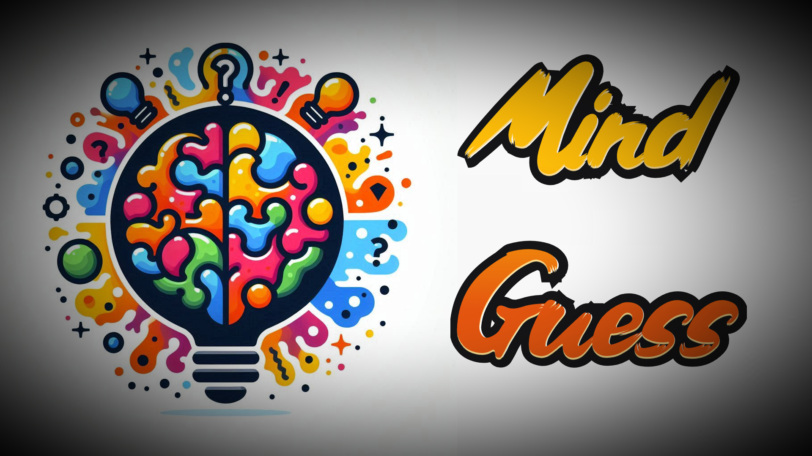

#   Hello! I'm GueDuAl 👋

### An aspiring programmer and future videogame developer from Spain.

 

 

💻 Higher Technician in IT and Multiplatform Application Development (MAD).
I have experience with Java, SQL, and Android Studio, and I'm constantly learning new technologies to improve my skills.

🎮 I'm passionate about creating innovative games and software, and my goal is to enter the videogame industry as a developer.

Let's build something awesome together!

# My projects:

## Mind Guess

<!---
saturnogit2000/saturnogit2000 is a ✨ special ✨ repository because its `README.md` (this file) appears on your GitHub profile.
You can click the Preview link to take a look at your changes.
--->

<!---
GueDuAl/GueDuAl is a ✨ special ✨ repository because its `README.md` (this file) appears on your GitHub profile.
You can click the Preview link to take a look at your changes.
--->
